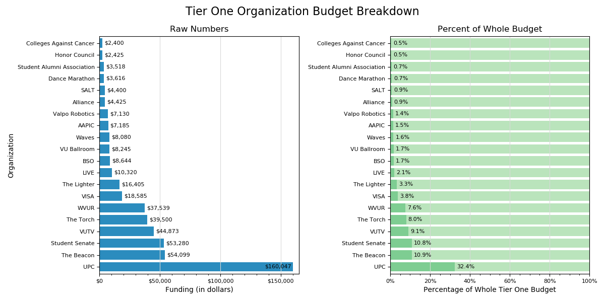
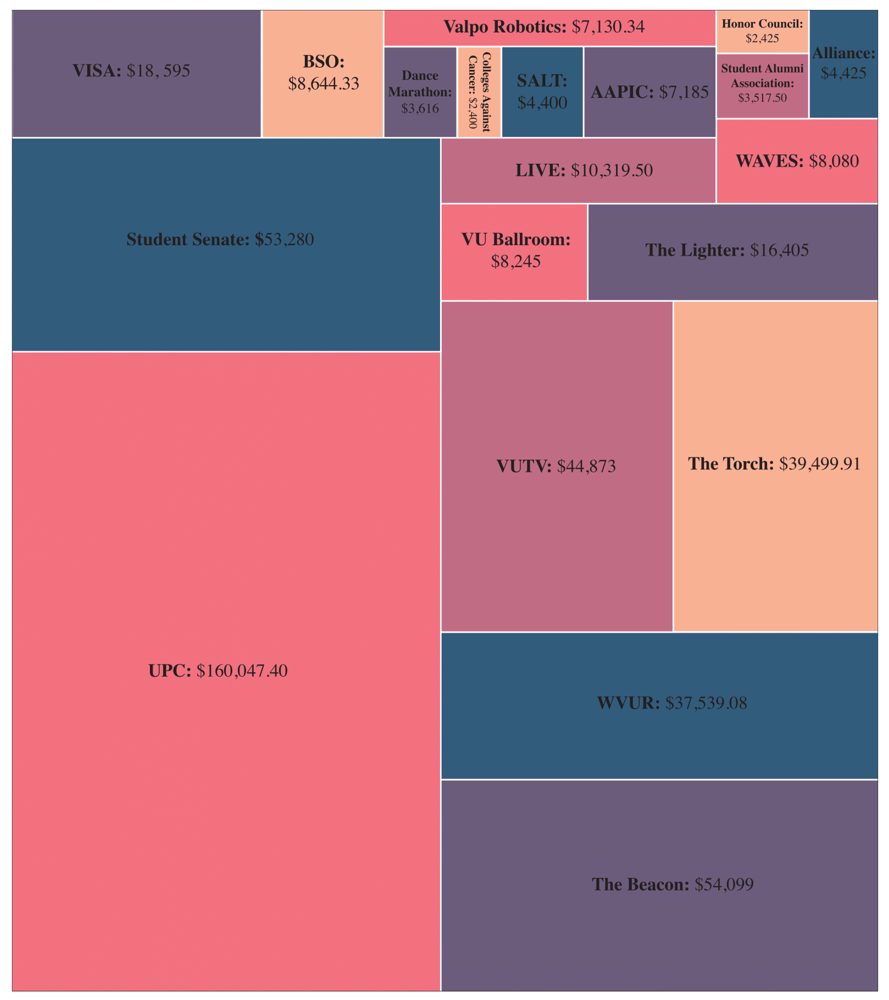

# mpl_redesign
The Matplotlib version of a graphic redesign originally done for my 2018 statistics colloquium class. For the original assignment, I implemented my team's design ideas using the Bokeh plotting library. For a small summer project, I decided to remake our new graphic using Matplotlib.

This is the redesigned graphic:

This is the original graphic that we were given to redo. It is from Valparaiso University's weekly newspaper, The Torch.
http://www.valpotorch.com/eedition/page_92105f33-314f-5fc2-9fa4-380c09398a28.html

